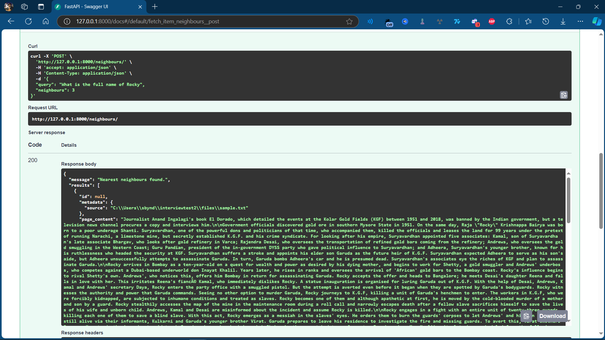
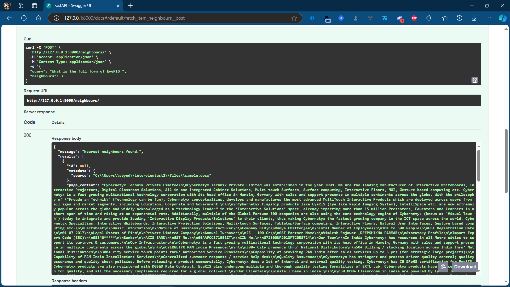

# FastAPI RAG Server with ChromaDB (Version 2)

## Description
This repository implements a lightweight FastAPI server designed for a Retrieval-Augmented Generation (RAG) system. The server leverages ChromaDB's persistent client to ingest and query documents. Currently, it supports PDF document ingestion and utilizes the `sentence-transformers/all-MiniLM-L6-v2` model from Hugging Face for embeddings.

### Features
- Create and delete a database for storing document embeddings.
- Query the nearest neighbors based on input queries.
- Asynchronous and non-blocking API endpoints for efficient concurrency handling.

## Installation
To get started, clone this repository and install the required dependencies:

```bash
git clone https://github.com/your_username/your_repo_name.git
cd your_repo_name
pip install -r requirements.txt
```

## Usage

To run the FastAPI server, use the following command:
```bash
uvicorn main:app --reload
```
Access the interactive API documentation at [Docs URL](http://127.0.0.1:8000/docs)

## Endpoints

- **GET /**: Returns a welcome message.
- **GET /create/**: Creates the database.
- **DELETE /delete/**: Deletes the database.
- **POST /neighbours/**: Fetches nearest neighbors based on the query.

## Example Request
Here’s an example of how to query the nearest neighbors:

{
  "query": "Your search term here",
  "neighbours": 5
}

## Output
Text Query


Docx Query


## Changes Made:
1. **Updated Description**: Mentioned that the server supports ingestion of PDF, DOCX, and TXT documents.
2. **Updated Features**: Added support for DOCX and TXT document formats in the features list.

Feel free to let me know if you need any more modifications or additional information!
